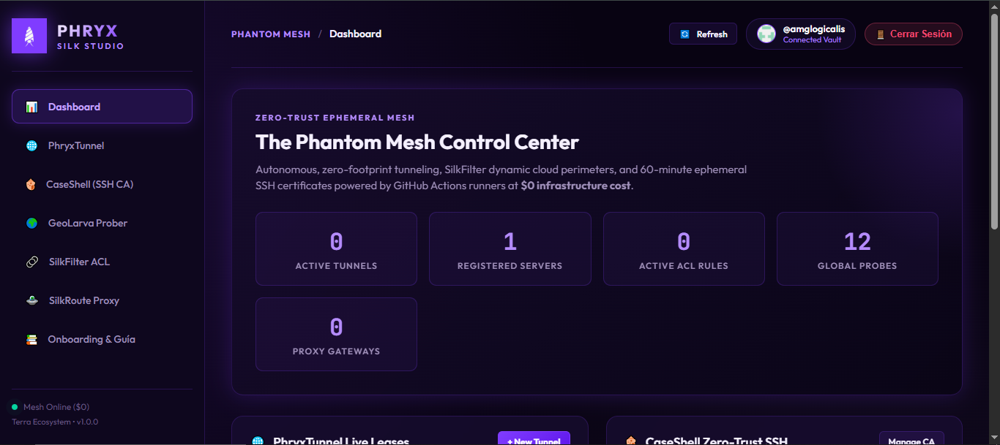

<p align="center">
  
</p>

<h1 align="center">PHRYX: The Phantom Mesh</h1>

<p align="center">
  <strong>Infraestructura de Red Privada Efímera, Túneles Zero-Trust y Perímetros Dinámicos a Coste $0</strong><br />
  <em>Parte del Ecosistema Terra • 100% Cero Dependencias • Computación Serverless en GitHub Actions</em>
</p>

<p align="center">
  <a href="https://www.npmjs.com/package/terra-phryx"></a>
  <a href="https://www.npmjs.com/package/terra-phryx"></a>
  <a href="https://nodejs.org"></a>
  <a href="LICENSE"></a>
  <a href="https://amglogicalis.github.io/phryx-repo-public/"></a>
</p>

---

## 🎛️ Consola Web Online — PHRYX Silk Studio

Accede al centro de control visual interactivo de Phryx directamente desde tu navegador en **GitHub Pages**. Gestiona túneles, autoridades certificadoras SSH, sondeos multi-región, reglas de firewall y proxies efímeros sin instalar nada en tu servidor:

<p align="center">
  <a href="https://amglogicalis.github.io/phryx-repo-public/" target="_blank">
    
  </a>
</p>

<p align="center">
  👉 <strong><a href="https://amglogicalis.github.io/phryx-repo-public/">🚀 Abrir Consola Web Online: amglogicalis.github.io/phryx-repo-public</a></strong> 👈
</p>

> **💡 Modo Dual:** La consola web funciona en modo **Cloud** (comunicándose directamente con la API de GitHub mediante tu Personal Access Token) y en modo **Local Hybrid** (conectándose en tiempo real al daemon local cuando inicias `phryx console --port 7461` en tu terminal).

---

## 🌊 Visión y Filosofía

Inspirado en la larva de la frigánea (*Phryganea* / Trichoptera) —un insecto acuático que teje con su propia seda un tubo protector portátil adherido con granos de arena y ramitas del entorno, el cual arrastra para protegerse y abandona al metamorfosearse sin dejar rastro—, **PHRYX** construye túneles cifrados y perímetros defensivos efímeros utilizando las primitivas gratuitas de **GitHub Actions** y criptografía nativa de **OpenSSH**.

Los recursos se crean bajo demanda, se utilizan el tiempo estrictamente necesario y se autodestruyen al terminar. **Cero infraestructura fija, cero costes operativos ($0), cero claves permanentes.**

```
                                🦟 PHRYX ENGINE
                 (The Phantom Mesh — Red Privada Efímera Terra)
                                        │
     ┌──────────────┬──────────────┬────┴─────────┬──────────────┬──────────────┐
     ▼              ▼              ▼              ▼              ▼              ▼
🌐 PhryxTunnel  🌍 GeoLarva   🐚 CaseShell   🔗 SilkFilter  🛸 SilkRoute   🗄️ Vault Mirror
 (Localhost →   (6 Continentes (SSH CA Zero-  (Dynamic ACL   (SOCKS5/HTTP   (.phryx-storage
  URL Pública    Azure Runners   Trust 60m     5 Fases Auto-  24/7 Lazarus    Cero Fuga de
  2 Motores)     Telemetría)     Cero Claves)   Purga CI/CD)   Cloud Relay)    Datos)
```

---

## ⚡ Instalación Rápida

Phryx se distribuye como un paquete unificado y ligero **sin dependencias externas en tiempo de ejecución** (`dependencies: {}`), compatible con **Node.js 18+** en Windows, Linux y macOS.

### 1. Ejecución Instantánea (npx)
```bash
# Iniciar un túnel público al puerto 3000
npx terra-phryx tunnel --port 3000

# Ejecutar sondeo global en 6 continentes
npx terra-phryx geo https://mi-app.com

# Consultar estado general del mesh
npx terra-phryx status
```

### 2. Instalación Global (CLI permanente)
```bash
npm install -g terra-phryx

# Ya tienes el binario `phryx` listo en tu terminal:
phryx tunnel --port 8080 --engine ssh
phryx console --port 7461
```

### 3. Como SDK en TypeScript / Node.js
```bash
npm install terra-phryx
```
```typescript
import { Phryx } from 'terra-phryx';

const phryx = new Phryx();
await phryx.init();

// Iniciar túnel programáticamente
const session = await phryx.startTunnel({
  port: 3000,
  engine: 'cloudflared',
  timeoutMinutes: 60,
});
console.log(`URL Pública: ${session.publicUrl}`);
```

---

## 📚 Las 5 Especies de Phryx

---

### 1. 🌐 PhryxTunnel — Túneles Públicos Reales a $0 (Cloudflare & OpenSSH)

Publica cualquier puerto local de tu equipo (ej. `localhost:3000`) a internet con una URL HTTPS segura y cifrada para webhooks de Stripe/GitHub, pruebas móviles o demos en vivo. Opera estrictamente con **2 únicos motores transparentes**:
- **`cloudflared`**: Edge global de Cloudflare (`*.trycloudflare.com`) con resolución DNS-over-HTTPS (DoH) integrada para eludir bloqueos locales de operadoras.
- **`ssh`**: OpenSSH nativo (`ssh.exe` en Windows / `ssh` en Unix) mediante túnel seguro con `localhost.run` (`*.lhr.life`). Cero bloqueos de antivirus.

#### Comandos CLI
```bash
# Iniciar túnel con Cloudflare (puerto 3000, timeout 60 min, CORS habilitado)
phryx tunnel --port 3000 --engine cloudflared --timeout 60 --cors

# Iniciar túnel con OpenSSH nativo
phryx tunnel --port 8080 --engine ssh

# Perfiles rápidos preconfigurados (nextjs-vite, webhook-listener, database-tcp)
phryx tunnel --port 3000 --preset nextjs-vite

# Diagnóstico del entorno (verifica binarios, DoH y puertos)
phryx tunnel doctor

# Probar conectividad activa E2E
phryx tunnel test <sessionId>

# Inspeccionar el tráfico reciente capturado
phryx tunnel inspect <sessionId>

# Rejugar una petición HTTP capturada contra localhost
phryx tunnel replay <sessionId> <logId>

# Detener o borrar un túnel
phryx tunnel stop <sessionId>
phryx tunnel delete <sessionId>

# Purgar de un solo golpe todas las sesiones inactivas del Vault
phryx tunnel purge

# Despachar runner en la nube en GitHub Actions ($0 compute)
phryx tunnel dispatch --port 3000 --engine cloudflared --timeout 30
```

#### Uso en SDK
```typescript
// Arrancar túnel
const tunnel = await phryx.startTunnel({
  port: 3000,
  engine: 'cloudflared',
  timeoutMinutes: 30,
  corsEnabled: true,
  basicAuth: { username: 'admin', password: 'secretpassword' }
});

// Probar salud del túnel
const health = await phryx.testTunnelHealth(tunnel.id);
console.log(`Estado: ${health.status} (${health.latencyMs}ms)`);

// Purgar inactivos del vault
const purgedCount = await phryx.purgeTunnels();
```

---

### 2. 🌍 GeoLarva — Sondeador Edge Multi-Región (100% Cloud CI/CD)

GeoLarva evalúa la latencia, disponibilidad y rendimiento de cualquier URL desde **6 continentes simultáneamente**. Se descartaron las simulaciones locales: cada petición es ejecutada por **máquinas virtuales reales en la nube de Azure / GitHub Actions**:
- 🇺🇸 **US East (Virginia)**
- 🇳🇱 **Western Europe (Ámsterdam)**
- 🇯🇵 **Southeast Asia (Tokio)**
- 🇧🇷 **Brazil South (São Paulo)**
- 🇦🇺 **Australia East (Sídney)**
- 🇿🇦 **South Africa (Johannesburgo)**

#### Comandos CLI
```bash
# Sondeo simultáneo a los 6 continentes (modo estricto cloud con streaming en vivo)
phryx geo https://mi-api.com --all

# Sondeo a una región específica
phryx geo https://mi-api.com --region southeast-asia

# Con parámetros avanzados (método, headers, repeticiones y umbral de alerta)
phryx geo https://mi-api.com --method POST --headers '{"Authorization":"Bearer 123"}' --repetitions 3 --threshold 400

# Ver historial de sondeos guardados en el Vault
phryx geo history

# Inspeccionar desglose de 5 fases (DNS, TCP, TLS, TTFB y Latencia Total)
phryx geo inspect <probeRunId>

# Exportar matriz como workflow reutilizable de GitHub Actions
phryx geo export https://mi-api.com --out .github/workflows/geo-matrix.yml

# Mantenimiento de histórico
phryx geo delete <probeRunId>
phryx geo clear
```

#### Uso en SDK
```typescript
// Sondeo global en 6 continentes
const matrix = await phryx.probeGlobal('https://api.github.com', {
  maxWaitSeconds: 45,
  onProgress: (count, total, lastRegion) => {
    console.log(`Recibidos ${count}/${total} continentes. Último: ${lastRegion}`);
  }
});

console.log(`Región más rápida: ${matrix.summary.fastestRegion}`);
console.log(`Latencia promedio: ${matrix.summary.avgLatencyMs}ms`);

// Inspeccionar corrida histórica
const probe = await phryx.getGeoProbe(matrix.id);
```

---

### 3. 🐚 CaseShell — Zero-Trust Ephemeral SSH (CA Ed25519)

Elimina el problema del "key sprawl" y las claves estáticas permanentes en `~/.ssh/authorized_keys`. Phryx opera como una **Autoridad Certificadora (CA) criptográfica nativa a $0**:
1. **Setup Day-0 (solo 1 vez):** Inyecta la clave pública de la CA en el servidor destino (`TrustedUserCAKeys /etc/ssh/phryx_ca.pub`).
2. **Emisión Just-in-Time (JIT):** Cuando un desarrollador o pipeline necesita entrar, solicita un certificado de 15 a 60 minutos con identificador de auditoría (Key ID).
3. **Expiración Automática:** Al cumplirse el tiempo, el certificado caduca criptográficamente. Cero riesgo de claves filtradas o accesos olvidados.

#### Comandos CLI
```bash
# Consultar huella (Fingerprint), clave pública y snippet de setup de la CA
phryx ssh ca

# Registrar un servidor en el inventario
phryx ssh register --alias prod-db --host 10.0.1.20 --user ubuntu --port 22

# Editar configuración de un servidor en caliente
phryx ssh edit prod-db --port 2222 --user admin

# Emitir certificado efímero y conectar de inmediato
phryx ssh cert prod-db --duration 30 --key-id INC-402

# Exportar la clave privada efímera para clientes gráficos (PuTTY / FileZilla / Termius)
phryx ssh cert prod-db --duration 60 --out-key ./id_ephemeral.pem

# Listar servidores registrados y revocar accesos
phryx ssh list
phryx ssh revoke prod-db
```

#### Uso en SDK
```typescript
// Registrar servidor
const { setupSnippet } = await phryx.registerSshServer({
  alias: 'staging-api',
  host: '192.168.1.100',
  user: 'deployer',
  port: 22,
});

// Emitir certificado firmado por la CA
const cert = await phryx.issueSshCertificate({
  serverAlias: 'staging-api',
  userPrincipal: 'deployer',
  validityMinutes: 45,
  keyId: 'DEPLOY-TICKET-89',
});

console.log(`Comando SSH listo: ${cert.sshCommand}`);
```

---

### 4. 🔗 SilkFilter (PhryxReach) — ACLs Dinámicas en CI/CD

Permite a los runners efímeros de GitHub Actions conectarse a bases de datos o servicios privados sin abrir puertos a `0.0.0.0/0`:
- **Fase 1 (Pre-check Closed):** Verifica que el puerto esté completamente bloqueado.
- **Fase 2 (Inject Rule):** Detecta la IP pública del runner y la añade temporalmente a la lista blanca del Security Group / Firewall.
- **Fase 3 (Verify Access):** Ejecuta la migración de base de datos o test protegido.
- **Fase 4 (Auto-Purge):** Revoca el permiso de inmediato al terminar.
- **Fase 5 (Post-check Closed):** Garantiza que no quedan puertos abiertos residuales (0 residual ports).

#### Comandos CLI
```bash
# Ejecutar ciclo completo de 5 fases en sandbox local
phryx reach run --mode sandbox

# Ejecutar contra Security Group de AWS o Firewall Cloud
phryx reach run --mode cloud --provider aws-sg --resource sg-0abc123 --port 5432

# Salida en JSON puro para pipelines automatizados
phryx reach run --mode sandbox --json

# Inyectar una regla temporal manualmente
phryx reach inject --provider cloudflare-ip-rule --resource zone-id --port 443

# Ver historial de auditoría de leases
phryx reach logs
phryx reach inspect <logId>
phryx reach clear-logs

# Registrar o eliminar proveedores
phryx reach add --provider aws-sg --resource sg-0abc123 --port 5432
phryx reach rm-provider aws-sg sg-0abc123

# Despachar el pipeline completo a un runner en GitHub Actions
phryx reach dispatch --provider aws-sg --resource sg-0abc123 --port 5432

# Purgar todas las reglas activas (kill-switch de emergencia)
phryx reach purge all
```

#### Uso en SDK
```typescript
// Ejecutar ciclo completo de 5 fases
const result = await phryx.runReachLifecycle({
  mode: 'cloud',
  provider: 'aws-security-group',
  resourceId: 'sg-0abc123456789def0',
  port: 5432,
});

if (result.allPhasesPassed && result.zeroPortsResidual) {
  console.log('✅ Acceso efímero completado y purgado sin puertos residuales.');
}
```

---

### 5. 🛸 SilkRoute — Proxies Cloud SOCKS5 y HTTP Efímeros (24/7 Lazarus)

Despliega servidores proxy SOCKS5 y HTTP efímeros en tu máquina local o en la infraestructura de GitHub Actions con IPs residenciales/cloud de Azure:
- **Persistencia Continua (Lazarus Relay):** Si GitHub Actions limita la duración de un runner a 6 horas, SilkRoute despacha automáticamente a su sucesor vía `workflow_dispatch` antes de expirar, manteniendo el túnel activo 24/7.
- **Doble Protocolo:** Soporta simultáneamente SOCKS5 (`socks5://`) y HTTP CONNECT proxy (`http://`).
- **DNS Remote Only:** Resolución de nombres delegada en el extremo remoto (`socks5h://`) para eludir censura y geofencing.

#### Comandos CLI
```bash
# Levantar gateway proxy local en segundo plano
phryx route spawn --mode local --socks-port 1080 --http-port 8080 --detach

# Despachar runner cloud en Europa Occidental con relevo 24/7 (Lazarus)
phryx route dispatch --region west-europe --lazarus --duration 60

# Listar gateways con filtrado por estado
phryx route list --status active
phryx route list --status history

# Probar latencia y salida a internet a través del proxy
phryx route test <sessionId>

# Ver telemetría en vivo (TX/RX, conexiones activas, peticiones)
phryx route metrics <sessionId>

# Generar variables de entorno para la terminal (HTTP_PROXY, ALL_PROXY)
phryx route env <sessionId>

# Detener o limpiar sesiones
phryx route stop <sessionId>
phryx route delete <sessionId>
phryx route clear --all
```

#### Uso en SDK
```typescript
// Crear gateway proxy
const gateway = await phryx.spawnRoute({
  mode: 'local',
  socksPort: 1080,
  httpPort: 8080,
  durationMinutes: 60,
  dnsRemoteOnly: true,
});

// Probar conexión
const testRes = await phryx.testRoute(gateway.id);
console.log(`Proxy Online: ${testRes.latencyMs}ms`);

// Obtener métricas de red
const metrics = phryx.getRouteMetrics(gateway.id);
console.log(`Tráfico cursado: ${metrics.rxBytes}B RX / ${metrics.txBytes}B TX`);
```

---

## 🗄️ Persistencia — Storage Vault (`.phryx-storage`)

Phryx almacena su configuración, certificados emitidos, logs de auditoría y métricas en tu propio repositorio privado **`.phryx-storage`** mediante la Git Database API de GitHub (y en el directorio local `.phryx_storage/`):

```
.phryx-storage/
├── tunnel-sessions/     # Registros de sesiones de túnel y logs de peticiones
├── ssh/
│   ├── servers.json     # Inventario de servidores y CA pública
│   └── sessions/        # Certificados firmados emitidos
├── reach/
│   ├── providers.json   # Configuración de Security Groups y Webhooks
│   ├── rules.json       # Leases temporales activos
│   └── history.json     # Traza de auditoría inmutable
├── geo/
│   ├── runs/            # Salidas en tiempo real de runners de Azure
│   └── history/         # Matrices consolidadas de 6 continentes
└── route-sessions/      # Estados de gateways SOCKS5/HTTP y métricas RX/TX
```

> **🔒 Privacidad Garantizada:** Cero servidores intermedios de terceros. Toda la información viaja exclusivamente entre tus equipos, tu repositorio de GitHub y la red de borde de Cloudflare/Azure.

---

## 🧭 Resumen de Comandos CLI

| Comando | Descripción |
| :--- | :--- |
| `phryx console [--port 7461]` | Inicia el servidor web local de **PHRYX Silk Studio**. |
| `phryx status` | Muestra el estado del mesh, storage vault y métricas activas. |
| `phryx init` | Inicializa el repositorio privado de almacenamiento en GitHub. |
| `phryx tunnel [flags]` | Inicia o gestiona túneles públicos locales (`--engine cloudflared\|ssh`). |
| `phryx tunnel doctor` | Diagnostica binarios locales, DoH y bloqueos de red. |
| `phryx tunnel purge` | Limpia todas las sesiones de túnel inactivas del Vault. |
| `phryx tunnel dispatch` | Despacha un túnel en runners de GitHub Actions ($0 compute). |
| `phryx ssh ca` | Consulta la huella, clave pública y snippet de setup de la CA. |
| `phryx ssh cert <srv>` | Emite un certificado efímero firmado por la CA (`--out-key`). |
| `phryx ssh edit <srv>` | Edita la configuración de un servidor registrado en caliente. |
| `phryx geo <url> [--all]` | Sondea disponibilidad y latencia desde 6 continentes reales. |
| `phryx geo export <url>` | Exporta matriz de sondeo como workflow de GitHub Actions. |
| `phryx geo inspect <id>` | Desglosa la telemetría de 5 fases de una corrida geográfica. |
| `phryx reach run [flags]` | Ejecuta el ciclo de vida de 5 fases de SilkFilter (`--json`). |
| `phryx reach logs` | Muestra el registro de auditoría de reglas perimetrales. |
| `phryx reach purge all` | Kill-switch de emergencia para revocar todas las reglas de ACL. |
| `phryx route spawn [flags]` | Inicia un gateway proxy SOCKS5 y HTTP local o cloud. |
| `phryx route dispatch` | Despacha un gateway proxy persistente 24/7 en GitHub Actions. |
| `phryx route list [--status]` | Lista proxies con filtro (`active`, `history`, `all`). |

---

## 📄 Licencia

Este proyecto está bajo la licencia **MIT** — consulta el archivo [LICENSE](LICENSE) para más detalles.

<p align="center">
  <sub>Desarrollado bajo la filosofía Terra • Infraestructura Efímera de Coste Económico $0</sub>
</p>
